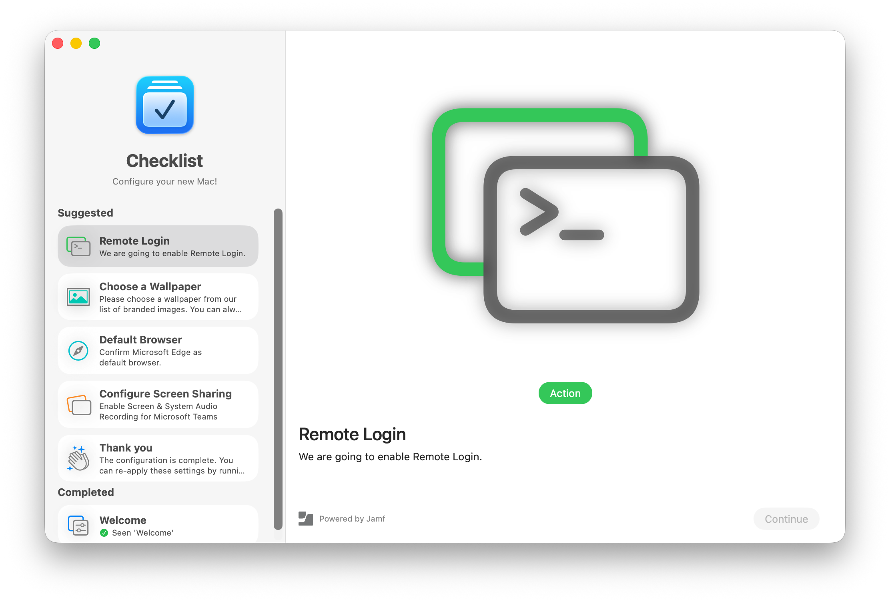

#  Script Step Example: Remote Login

The `script` documentation is pretty abstract, so this will explore the options with an example implementation.

## Background Enable Remote Login

The Remote Login section in Settings > General > Sharing controls whether SSH is runnning and accepting connections from remote servers. macOS does have means to automatically enable Remote Login using the `systemsetup -setRemoteLogin` command, but that has downsides: the process running the `systemsetup` command requires Full Disk Access. This is generally not an issue with device management services, since these usually provide themselves full disk access. 

For the sake of this example, we will use a Setup Checklist `script` step to have the user enable Remote Login interactively. This may be useful for situations, where you want the user to be aware that Remote Login/SSH is enabled and to learn where to enable (and later disable) the service.

## The shell commands

Before you start implementing a `script` step, you should be familiar with script commands required in this context. Since we are going to delegate.

We cannot use the `systemsetup -setRemoteLogin` command, since that requires root access. Instead we are going to open the Remote Login pane in System Settings for the user, where they can click the switch to turn it on. You could open System Settings with `open -a "System Settings"` but there [are many settings/preferences urls](https://github.com/paralevel/macos-settings-urls) that can be used to open System Settings directly to a pane. For the Remote Login pane, the url is `x-apple.systempreferences:com.apple.preferences.sharing?Services_RemoteLogin`.

You can experiment with this in Terminal by running:
 
```
open 'x-apple.systempreferences:com.apple.preferences.sharing?Services_RemoteLogin'
```

Next we need a way to check whether Remote Login/SSH is enabled. `systemsetup -getRemoteLogin` would work, but it (again) requires admin privileges, so we need to find a different option.

Enabling Remote Login/SSH loads a system launch daemon with the identifier `com.openssh.sshd`. We can see whether that is running using `launchctl print system/`, which conveniently does not require admin privileges. Among that output is a line `"com.openssh.sshd" => disabled` or `enabled` depending on whether Remote Login is disabled or enabled. We can test for this by piping the output into `grep`:

```sh
launchctl print system/ | grep -q '"com.openssh.sshd" => enabled'
```

This command will have an exit code of `0` (success) when the `grep` finds the string, i.e. Remote Login is enabled, and `1` (failure) when it doesn't.

**Note:** in the standard configuration, zsh in macOS does not visualize the exit code of a command or series of commands. You can print the exit code of the previous command with `echo $?`, but is generally very useful to change your shell prompt to include the exit code of the previous command. There are several tools you can use for changing your shell prompt, or you [can do it yourself](https://scriptingosx.com/2019/07/moving-to-zsh-06-customizing-the-zsh-prompt/). 

Finally, we want to quit the System Settings app when the user hits continue. You can quit an app using this command:

```shell
osascript -e 'tell app "System Settings" to quit"
```

We can also use the [`setupchecklist` command line tool](../Extras/CommandLineTool.md) to update the status and other values of the step:

```shell
setupchecklist step script-remote-login icon "symbol:apple.terminal.circle"
```

## Starting point, minimal step

Start with the basic `dict` for our `script` step:

```xml
<dict>
  <key>identifier</key>
  <string>script-remote-login</string>
  <key>kind</key>
  <string>script</string>
  <key>message</key>
  <string>We are going to enable Remote Login.</string>
  <key>title</key>
  <string>Remote Login</string>
</dict>
```

This will already display something, though the 'Action' button won't do anything and the 'Continue' button is disabled, so the user is stuck here, for now.



## Prepare Script

First, add a `prepareScript` to the step:

```xml
<dict>
  <key>identifier</key>
  <string>script-remote-login</string>
  <key>kind</key>
  <string>script</string>
  <key>message</key>
  <string>We are going to enable Remote Login.</string>
  <key>prepareScript</key>
  <string>setupchecklist step script-remote-login image symbol:apple.terminal.circle</string>
  <key>title</key>
  <string>Remote Login</string>
</dict>
```

Note that the order of `key`s in a property list `dict` do not matter. Most tools to build and read property list files will sort the keys alphabetically, so this is how they will be represented here.

This will run the script, which runs the `setupchecklist` command we saw earlier to switch the `image` of the step.


Note that this is a very simplified example. In general, you should use the `prepareScript` to verify that all resources that the step requires are available. For example, you could verify that ssh is configured properly before allowing the user to enroll it. If the prerequisites are not available, the `prepareScript` should set the status of the step to `error`.

For example:

```
  <key>prepareScript</key>
  <string>
  if [ ! -e /etc/ssh/sshd_config.d/myorg-ssh.conf ]; then
      setupchecklist status script-remote-login error
  fi
  </string>
```

The `prepareScript` is run when the app loads the step data at launch, and then _again_ everytime, just before the step is displayed. Keep this in mind, the `prepareScript` should run quickly. Also actions that should only be performed when the step is displayed, but not at app load, should be in the `activateScript`.

## Activate Script

There might be extra things you want to do when a step is actually displayed, but that should not be performed everytime . For this reason, there is the `activateScript` that is performed only when the step is displayed. This might still happen multiple times since a user can re-select a step from the sidebar list. The `activateScript` is always preceded by a `prepareScript` (when it exists), so you should avoid redundant code in the two.

The activateScript might contain code that prepares the action. In some cases you want the execution of the action to be optional, so the 'Continue' button should enable immediately, whether the user clicks the action button or not. In that case you can add an `activateScript` that sets the step's status to `canContinue` or `completed`.

```xml
  <key>activateScript</key>
  <string>setupchecklist status script-remote-login canContinue</string>
```

In our example, we don't really have anything to do at this time, so we don't add an `activateScript`. In most situations, you won't need to implement all script options.

## Button Script

The `buttonScript` gets executed when the user clicks the button. In our example, we want to open the url that open the Remote Login pane in System Settings.

```xml
  <key>buttonScript</key>
  <string>open 'x-apple.systempreferences:com.apple.preferences.sharing?Services_RemoteLogin'</string>
  <key>buttonLabel</key>
  <string>Open Remote Login…</string>
```

If you want to enable the 'Continue' button when the `buttonScript` is done, you need to do so explictly by setting the step's status to `canContinue` or `completed` with `setupchecklist status script-remote-login completed`.

In our example, we do not want to automatically set the step as completed, but need to observe the state of the system until the user enables the 'Remote Login' service.

## Update Status Script

The `updateStatusScript` is a key piece of the `script` step and works slightly different than other scripts. The `updateStatusScript` is called to verify whether state on the system matches the desired outcome of this step. When it does, it should return `0` (success), otherwise a non-zero exit code (failure).

The `updateStatusScript` will be called after the `prepareScript`. When it returns success, the step will be marked as completed immediately and not presented to the user. (The user can still click on it in the list to repeat the process.) When it returns a non-zero value, the step will remain in the 'suggested section.'

When an `updateStatusScript` exists, Setup Checklist will start observing by running the `updateStatusScript` once per second, when the action button is clicked. For that reason, it should not have complicated, long running logic.

Not all `script` steps will require an `updateStatusScript` you can also use logic in the `activateScript` or `buttonActionScript` to update the status of the step. If you don't update the status of the script to `completed` or `canContinue`, the 'Continue' button will not activate and the user will be stuck.

In our case, we have our `launchctl` command from earlier which already returns `0` (success) when the service is enabled. so we can add that to the step property list:

```xml
<key>updateStatusScript</key>
<string>launchctl print system/ | grep -q '"com.openssh.sshd" =&gt; enabled'</string>
```

**Note** that the `>` character needs to be escaped to `&gt;`. Same for `&` (`&amp;`) and `<` (`&lt;`).

## Will Continue Script

We would also like to close the Settings app again, when the user hits the 'Continue' button. The `willContinueScript` is launched then.

```xml
<key>willContinueScript</key>
<string>osascript -e 'tell app "System Settings" to quit'</string>
```

## Complete Script Step

This brings us to this `script` step:

```xml
<dict>
  <key>buttonLabel</key>
  <string>Open Remote Login…</string>
  <key>buttonScript</key>
  <string>open 'x-apple.systempreferences:com.apple.preferences.sharing?Services_RemoteLogin'</string>
  <key>identifier</key>
  <string>script-remote-login</string>
  <key>kind</key>
  <string>script</string>
  <key>message</key>
  <string>We are going to enable Remote Login.</string>
  <key>prepareScript</key>
  <string>setupchecklist step script-remote-login image symbol:apple.terminal.circle</string>
  <key>title</key>
  <string>Remote Login</string>
  <key>updateStatusScript</key>
  <string>launchctl print system/ | grep -q '"com.openssh.sshd" =&gt; enabled'</string>
  <key>willContinueScript</key>
  <string>osascript -e 'tell app "System Settings" to quit'</string>
</dict>
```

## A note on Shebangs and multi-line scripts

Setup Checklist will insert a `#!/bin/sh` at the start of a script when no other shebang is given. This simplifies the scripts significantly.

However, you can have scripts interpreted by other languages when you explicitely set a different shebang, such as `#!/bin/zsh` or `#!/usr/bin/osascript`

For example, you could also provide the AppleScript one-liner to quit Settings app like this:

```
<key>willContinueScript</key>
<string>
#!/usr/bin/osascript
tell app "System Settings" to quit
</string>
```

Note that you need to insert a real new line into the xml for new line characters.

## Logging

When [the `scriptLogging` key](../Profile/SetupChecklist.md#script-step-logging) in the profile is set to `true`, execution of scripts in a `script` step and their output is written to `~/Library/Logs/SetupChecklist-Scripts.log`.

