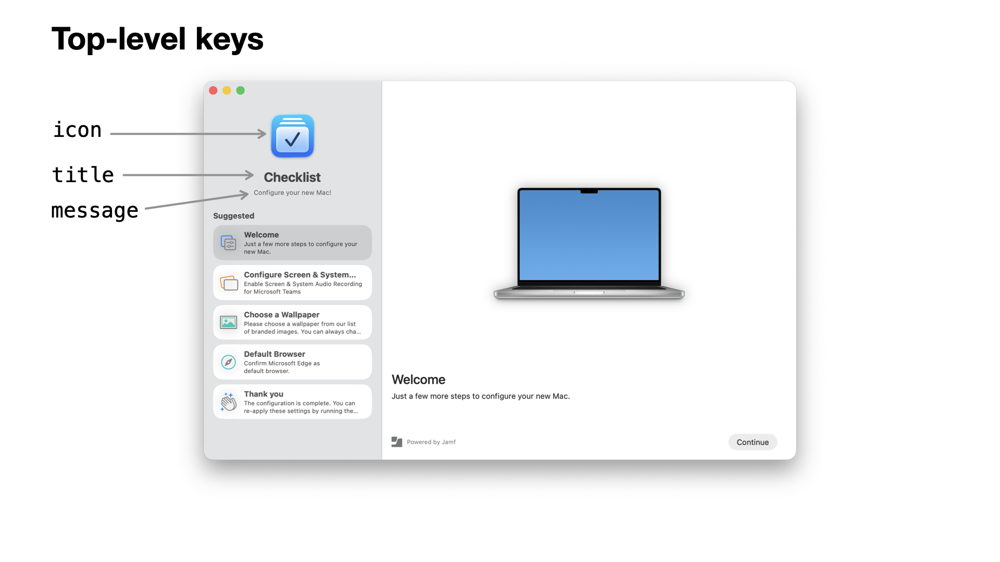
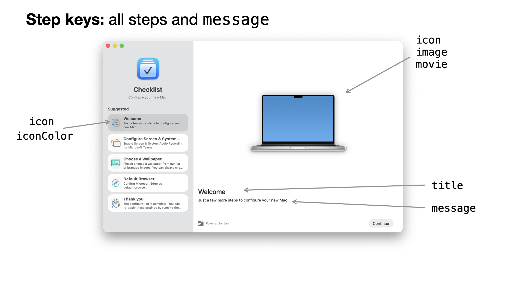
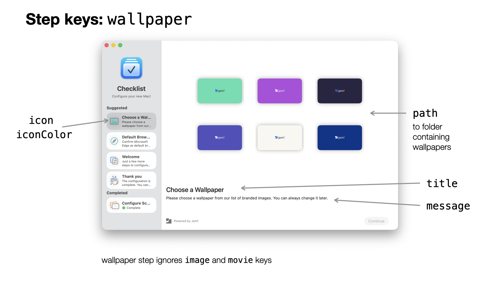
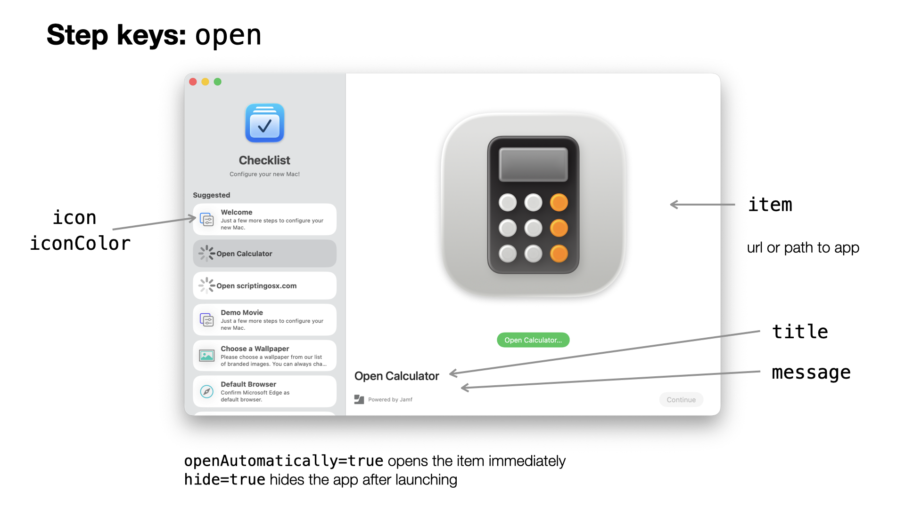
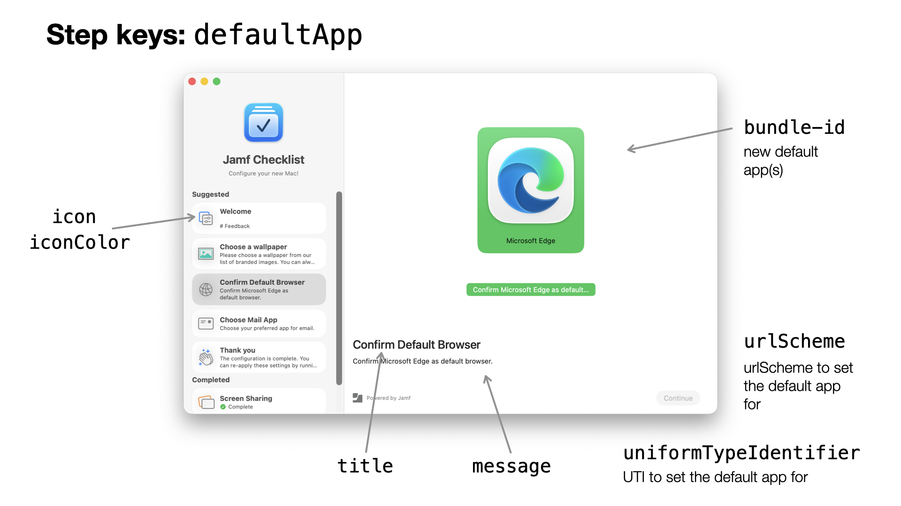
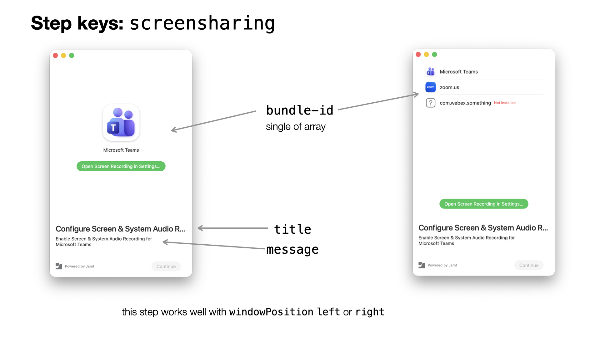

#  Configuration Profile - Setup Checklist

Note that the Welcome app which displays the full screen welcome and language is controlled by [a separate preference domain.](Welcome.md)

Preference domain: `com.jamf.setupchecklist`

You can find [an example plist file here](../Examples/com.jamf.setupchecklist.plist).

#### Debug Mode

key: `DEBUG`, boolean, optional, default: `false`

When set to true, the app will not actually perform any steps that will change a setting. Some other settings will also behave differently in DEBUG mode which will be called out in the documentation.

#### Icon

key: `icon`, string/[image source](ImageSources.md), [localizable](Localization.md), default: Setup Checklist app icon

The icon used at the top of the sidebar. The size of the icon is 90x90 pixels. (180x180 @ 2x)

```xml
<key>icon</key>
<string>name:Checklist</string>
```



#### Title

key: `title`, string, [localizable](Localization.md), default: 'Setup Checklist'

The title shown at the top of the sidebar, under the icon.

```xml
<key>title</key>
<string>Checklist</string>
```

#### Message

key: `message`, string/[markdown](../Extras/Markdown.md), [localizable](Localization.md), default: 'Start here to set up your Mac.' (localized)

Short message shown under the icon and title in the sidebar.

```xml
<key>message</key>
<string>Configure your new Mac!</string>
```

#### Accent Color

key: `accentColor`, string/[color definition](DefiningColors.md), optional, default: system accent color

Sets the accent color for buttons, progress bar, SF Symbols, and other UI elements. Use this to match branding. See ['Defining Colors'](DefiningColors.md) for details.

Examples:

```
<key>accentColor</key>
<string>#FF0088</string>
```

```
<key>accentColor</key>
<string>##red</string>
```

#### Hide other Apps

key: `hideOtherApps`, boolean, optional, default: `true`

Controls whether other apps are hidden at launch. Other apps are _not_ hidden when running in DEBUG mode.

Example:

```xml
<key>hideOtherApps</key>
<true/>
```

#### Open When Finished

key: `openWhenFinished`, string, optional

When set, this item will be opened when the user clicks "Done" on the last step and Setup Checklist quits. This item can be written as an absolute path, e.g. `/Applications/Self Service+.app`, a URL scheme, e.g. `jamfselfservice:`, or an app bundle identifer, e.g. `com.jamf.selfserviceplus`.

Example:

```xml
<key>openWhenFinished</key>
<string>com.jamf.selfserviceplus</string>
```

#### Show Icon in Dock

key: `showIconInDock`, boolean, optional, default: `true`

Controls whether app icon is shown in the Dock. Icon will _always_ show in Dock when running in DEBUG mode.

```xml
<key>showIconInDock</key>
<false/>
```

#### Script step logging

key: `scriptLogging`, boolean, default: `false`

When enabled, execution of scripts in a `script` step and their output is written to `~/Library/Logs/SetupChecklist-Scripts.log`.

## Steps

key: `steps`, array of dicts, required

The workflow in the Welcome app is divided into steps. Each step is shown as its own page and can perform actions.
Some steps will only display a message, an image, and/or a movie. Other steps will interact with the user and perform tasks depending on their selection.

### The Kind of Step

key: `kind`, String, required

Each step requires a `kind` key.

The available kinds are:

- `message`
- `wallpaper`
- `defaultApp`
- `open`
- `scrensharing`
- `script`

#### Identifier

key: `identifier`, string, required, unique

Each step requires an identifier which needs to be *unique* among all steps. When there are two or more steps with the same identifier, only the first step will be used. You will see an error in the log.

The identifier is used for logging and tracking which steps have already been completed. You can use any text, as long as it unique. It is helpful to keep the identifier descriptive. I.e. use `browser-edge` for a step that sets the default browser to MS Edge or `message-greeting` for a step that shows a greeting message.

### Keys Common to all Steps



All steps share these keys:

#### Title

key: `title`, string, [localizable](Localization.md), optional, default depends on the step kind

The title of the shown in the sidebar list and the step view.

#### Message

key: `message`, string/[markdown](../Extras/Markdown.md), [localizable](Localization.md), optional

A longer description of the step. This should contain some instructions of what needs to done.

#### Icon

key: `icon`, string/[image source](ImageSources.md), [localizable](Localization.md), optional, default depends on the step kind

The icon used for the step in the sidebar list. When no `image` or `movie` is set for a step, generally the `icon` is displayed in the step area, as well, though some kinds of steps have different behavior here.

The size of the icons in the list view is 36x36 pixels. (72x72 @2x) But since the same image may be used in place of the larger image, you may want to use higher resolution or scalable graphics (svg, pdf) here.

```xml
<key>icon</key>
<string>symbol:hand.thumbsup</string>
```

#### Image

key: `image`, String/[image source](ImageSources.md), [localizable](Localization.md), optional, default: `icon`

The image shown at the top of the step area. When the `image` has a value, that will be shown instead of a `movie`. When no `image` or `movie` key is set, `icon` will be used.

Some step kinds will have other defaults for the image, i.e. the `browser` step will use the target default browser's app icon. 

The size of the area available to the image will vary with window size and position, but 16:9 ratio landscape or square images work well.

```xml
<key>image</key>
<string>/System/Applications/Utilities/Screen Sharing.app</string>
```

#### Icon Color

key: `iconColor`, String/[color definition](DefiningColors.md), optional, default depends on the step kind

The highlight color used for SF Symbol icons and images. (Not all SF Symbols have a highlight color.)

Example:

```xml
<key>icon</key>
<string>symbol:hands.and.sparkles</string>
<key>iconColor</key>
<string>##teal</string>
```

#### Movie

key: `movie`, String, [localizable](Localization.md), optional

When set, the app will load this movie and display at the top of the step area. When the `image` key is set, that will be displayed instead of a movie.

The `movie` can be an absolute path to a local movie file or a `https` url.

The movie will loop (start over when it reaches the end) and is muted. Animated GIFs do _not_ work as movies.

The size of the area available to the image will vary with window size and position, but 16:9 ratio landscape or square movies work well.

```xml
<key>movie</key>
<string>/Library/Branding/Intro.mov</string>
```

key: `autoplay`, boolean, optional, default: true, v0.3.4
key: `loop`, boolean, optional, default: true, v0.3.4
key: `mute`, boolean, optional, default: true, v0.3.4

When a `movie` key is set, these keys control the behavior of the movie:

- `autoplay`: controls whether the movie starts playing automatically
- `loop`: controls whether the movie loops continuously
- `mute`: controls whether the audio is muted when the movie starts playing

```xml
<key>autoplay</key>
<false/>
<key>loop</key>
<true/>
<key>movie</key>
<string>/Library/Branding/ESA_logo_animation_compressed.mp4</string>
<key>mute</key>
<false/>
```

### Window Position

key: `windowPosition`, string, default: `center`

When this key is set to `left` or `right` the window will be moved to left or right edge of the screen for this step and the sidebar will be hidden.

Example: 

```xml
<key>windowPosition</key>
<string>right</string>
```

## Step Kinds

Different kinds of steps may have more keys to configure their behavior.

### Message

kind: `message`

A Message step displays a title, a message and an icon. This is the most basic step and has no interaction.

Example: 

```xml
<dict>
  <key>icon</key>
  <string>symbol:hand.thumbsup</string>
  <key>identifier</key>
  <string>message-thankyou</string>
  <key>image</key>
  <string>/Library/Branding/BrandImage.png</string>
  <key>kind</key>
  <string>message</string>
  <key>message</key>
  <string>The configuration is complete. Enjoy your Mac!</string>
  <key>title</key>
  <string>Thank you</string>
</dict>
```

### Wallpaper

kind: `wallpaper`

This step presents a grid of images in the given folder path and allows the user to set one as their wallpaper on all attached screens.



Example:

```xml
<dict>
  <key>identifier</key>
  <string>wallpaper</string>
  <key>kind</key>
  <string>wallpaper</string>
  <key>path</key>
  <string>/Library/Desktop Pictures</string>
</dict>
```

#### Path to Folder of images

key: `path`, string, optional, default: `/Library/Desktop Pictures`

All image files in this folder will be presented.

#### May keep current

key; `mayKeepCurrent`, boolean, optional, default: false

When this key is enabled, the user can continue without changing the wallpaper.

### Open

(kind: `open`)

Prompts the user to open an app, file or URL.

When the `title` is unset it will be 'Open <name>…' where '<name>' is the name of the app that will open the item. When `icon` is unset, it will be the icon of the app that will open the item.



Examples:

Open a website in the default browser:

Since the `icon` is not set this will show the app icon of the default browser.

```xml
<dict>
  <key>identifier</key>
  <string>open-scriptingosx</string>
  <key>item</key>
  <string>https://scriptingosx.com</string>
  <key>kind</key>
  <string>open</string>
  <key>title</key>
  <string>Open Scripting OS X</string>
</dict>
```

Open an application:

Since the `icon` is not set this will show the calculator app icon. Since the `title` is not set this will show 'Open Calculator…'

```xml
<dict>
  <key>identifier</key>
  <string>open-calculator</string>
  <key>item</key>
  <string>/System/Applications/Calculator.app</string>
  <key>kind</key>
  <string>open</string>
  <key>openAutomatically</key>
  <true/>
</dict>
```

#### Item

key: `item`, string, required

The item to open. The item can be an absolute path to a local file or app, e.g. `/Applications/Microsoft Company Portal.app`, or it can be a URL, e.g. `https://jamf.com` or `x-apple.systempreferences:com.apple.preference.security?Privacy_ScreenCapture`, or it can be an app bundle identifier, e.g. `com.jamf.selfserviceplus`

#### Open Automatically

key: `openAutomatically`, boolean, default: false

When enabled, the item will be opened automatically when the step is displayed.

#### Hide

key: `hide`, boolean: default: false

Launches the app or URL, but hides the app (or keeps the app in the background). This is useful when you need to launch a process that should not be visible to the user.

### Default App

kind: `defaultApp`

Prompts the user to confirm or choose an app as the default for a url scheme (e.g. `http` or `mailto`) or unified type identifier (e.g. `public.txt` or `com.adobe.pdf`).



Examples: 

Browser, single choice, user is required to set Microsoft Edge as default browser to continue

```xml
<dict>
  <key>bundle-id</key>
  <string>com.microsoft.edgemac</string>
  <key>icon</key>
  <string>symbol:network</string>
  <key>identifier</key>
  <string>default-app-browser</string>
  <key>kind</key>
  <string>defaultApp</string>
  <key>mayKeepCurrent</key>
  <false/>
  <key>message</key>
  <string>Confirm Microsoft Edge as default browser.</string>
  <key>title</key>
  <string>Confirm Default Browser</string>
  <key>urlScheme</key>
  <string>http</string>
</dict>
```

Email app, user can choose between retaining current app (usually Mail) and Microsoft Outlook

```xml
<dict>
  <key>bundle-id</key>
  <string>com.microsoft.Outlook</string>
  <key>icon</key>
  <string>symbol:mail</string>
  <key>identifier</key>
  <string>default-app-mail</string>
  <key>kind</key>
  <string>defaultApp</string>
  <key>mayKeepCurrent</key>
  <true/>
  <key>message</key>
  <string>Choose your preferred app for email.</string>
  <key>title</key>
  <string>Choose Mail App</string>
  <key>urlScheme</key>
  <string>mailto</string>
</dict>
```

PDF app, user has two choices:

```xml
<dict>
  <key>bundle-id</key>
  <array>
    <string>com.apple.Preview</string>
    <string>com.adobe.Acrobat.Pro</string>
  </array>
  <key>icon</key>
  <string>symbol:richtext.page</string>
  <key>identifier</key>
  <string>default-app-pdf</string>
  <key>kind</key>
  <string>defaultApp</string>
  <key>mayKeepCurrent</key>
  <true/>
  <key>message</key>
  <dict>
    <key>de</key>
    <string>Wähle deine bevorzugte app für PDF.</string>
    <key>en</key>
    <string>Choose your preferred app for PDF.</string>
    <key>fr</key>
    <string>Choisissez votre application préférée pour PDF.</string>
    <key>nl</key>
    <string>Kies uw favoriete app voor PDF.</string>
  </dict>
  <key>title</key>
  <dict>
    <key>de</key>
    <string>PDF App wählen</string>
    <key>en</key>
    <string>Choose PDF App</string>
    <key>fr</key>
    <string>Choisir l'application PDF</string>
    <key>nl</key>
    <string>Kies de PDF-app</string>
  </dict>
  <key>uniformTypeIdentifier</key>
  <string>com.adobe.pdf</string>
</dict>
```

#### Bundle Identifier

key: `bundle-id`, string or array of strings, required

The app [bundle identifier](../Extras/BundleIdentifiers.md) for the browser, e.g. `org.mozilla.firefox`. When the app cannot be found when Welcome app runs (i.e. the browser is not installed yet, this step will be skipped)

You can use [`utiluti`](https://github.com/scriptingsox/utiluti) to get a list of apps and their bundle identifiers for a given url scheme or universal type identifier:

```shell
$ utiluti url list mailto --bundle-id
com.microsoft.Outlook
com.apple.mail
```

```shell
$ utiluti type list public.text --bundle-id
com.apple.TextEdit
com.barebones.bbedit
com.apple.dt.Xcode
com.microsoft.edgemac
com.google.Chrome
com.apple.Notes
```

Common app identifiers:

| Web Browser               | bundle identifier                 |
|---------------------------|-----------------------------------|
| Safari                    | com.apple.safari                  |
| Firefox                   | org.mozilla.firefox               |
| Google Chrome             | com.google.Chrome                 |
| Microsoft Edge            | com.microsoft.edgemac             |
| Safari Technology Preview | com.apple.SafariTechnologyPreview |

| Mail                      | bundle identifier                 |
|---------------------------|-----------------------------------|
| Apple Mail                | com.apple.mail                    |
| Microsoft Outlook         | com.microsoft.Outlook             |
| Google Chrome             | com.google.Chrome                 |
| Microsoft Edge            | com.microsoft.edgemac             |
| Safari Technology Preview | com.apple.SafariTechnologyPreview |

#### URL scheme

key: `urlScheme`, string or array of strings, one of either `urlScheme` or `uniformTypeIdentifier` is required

The url scheme to set the default application for. E.g. `http` or `mailto`

When multiple values are given the first value is used is used to determine the current default app and whether changing the default app succeeded. The step will attempt to set the selected app as the default for each `urlScheme`.

When both `urlScheme` and `uniformTypeIdentifier` values are provided the first `urlScheme` is used to determine the current default app and whether changing the app succeeded.

Common url schemes:

| App Type    | URL scheme | system default app | Notes                                   |
|-------------|------------|--------------------|-----------------------------------------|
| Web Browser | http       | Safari             | also sets `https` and `public.html`     |
| Mail        | mailto     | Mail               |                                         |

#### Uniform type identifier

key: `uniformTypeIdentifier`, string or array of strings, one of either `urlScheme` or `uniformTypeIdentifier` is required

The uniform type identifier to set the default application for. E.g. `public.text` or `com.adobe.pdf`

When multiple values are given the first value is used is used to determine the current default app and whether changing the default app succeeded. The step will attempt to set the selected app as the default for each value in `uniformTypeIdentifier`.

When both `urlScheme` and `uniformTypeIdentifier` values are provided the first `urlScheme` is used to determine the current default app and whether changing the app succeeded.

You can get the uniform type identifier from a file extension using [`utiluti`](https://github.com/scriptingsox/utiluti):

```shell
$ utiluti get-uti pdf
com.adobe.pdf
```

Common uniform type identifiers:

| File Extension | Uniform Type Identifier      | system default app |
|----------------|------------------------------|--------------------|
| txt            | public.text                  | Text Edit          |
| pdf            | com.adobe.pdf                | Preview            |

#### May keep current

key; `mayKeepCurrent`, boolean, optional, default: false

When this flag is set to `true` Setup Checklist will add the current default app to the list, even when it is not yet listed in the `bundle-ids` and the user is allowed to click 'Continue' without changing the default app.

The difference between setting this flag and including the system default app in the list of `bundle-ids` is that when the system default app is present in the list of `bundle-ids` the step will be marked as `completed` when it is loaded and not shown. When this flag is set and the current default app is not in the list of `bundle-ids` this step will appear in the 'suggested' list.

### Screen Recording/Sharing

kind: `screensharing`

This step will open the Screen Recording pane in Settings > Privacy & Security and monitor the state of the switches for the designated apps until all are enabled.

**Important:** this steps _requires_ the "Full Disk Access" privacy access enabled, which in a managed environment [is best granted with a PPPC profile.](Overview.md#managed-login-items-and-privacy-preferences-policy-control).

This step works well with a `windowPosition` setting of `left` or `right`



Example: 

```xml
<dict>
  <key>bundle-id</key>
  <array>
    <string>com.microsoft.teams2</string>
    <string>us.zoom.xos</string>
  </array>
  <key>icon</key>
  <string>symbol:rectangle.on.rectangle.angled</string>
  <key>identifier</key>
  <string>screensharing</string>
  <key>kind</key>
  <string>screensharing</string>
  <key>message</key>
  <string>Enable Screen &amp; System Audio Recording for Microsoft Teams</string>
  <key>openAutomatically</key>
  <true/>
  <key>title</key>
  <string>Configure Screen Sharing</string>
  <key>windowPosition</key>
  <string>right</string>
</dict>
```

#### Bundle Identifier

key: `bundle-id`, String or array of strings, required

The app [bundle identifier](../Extras/BundleIdentifiers.md) or identifiers for the application or tool which should be enabled for Screen Recording.

When no app with the bundle-identfier is found (usually the app is not installed yet) then it will be shown with a "not installed" label, but the user can proceed. When none of the apps are installed, this step will be skipped. The user can launch the app later, after the app(s) are installed and this step will show status correctly then.

You can give a single bundle identifier with a `string`:

```xml
<key>bundle-id</key>
<string>com.microsoft.teams2</string>
```

Or you can provide multiple identifiers with an array of strings:

```xml
<key>bundle-id</key>
<array>
  <string>com.microsoft.teams2</string>
  <string>us.zoom.xos</string>
</array>
```

Common identifiers for apps requiring Screen Recording access:

|Browser            |identifier           |
|-------------------|---------------------|
|zoom.us            |us.zoom.xos          |
|Microsoft Teams    |com.microsoft.teams2 |


#### Open Automatically

key: `openAutomatically`, boolean, default: false

When enabled, the Screen Recording pane in System Settings app will be opened automatically when the step is displayed.

```xml
<key>openAutomatically</key>
<true/>
```

### Script

kind: `script`

This is a special step where you can configure the behavior in each phase of the step's life cycle with custom scripts, provided in the profile.

You can find [a detailed discussion of an example implementation here](ScriptStep.md).

The `script` step is based on the `open` step, so all those keys are available here as well. In addition you get a number of keys to provide scripts to influence the step's behavior. All keys are optional and default behavior is described in each script description.

**Warning:** _Here there be dragons!_

This step allows you to define your own behavior, but this also means that errors in the script could lead to unwanted or even detrimental outcomes. Setup Checklist runs with user privileges, so scripts launched here can only affect user space, but there is still a lot of damage that could occur here.

While we hope there will be many good examples for script steps byt other Mac Admins, you should not trust any of these blindly and without understanding the code and testing.

_Always test thoroughly!_

It depends on what data the scripts actually access, but it is likely that they will require the "Full Disk Access" privacy access enabled, which in a managed environment [is best granted with a PPPC profile.](Overview.md#managed-login-items-and-privacy-preferences-policy-control).

When you have `script` steps start processes that require other PPPC exemptions, such as sending Apple Events/AppleScript to another process, then you need to give this PPPC setting to Setup Checklist, since the system will see it as the parent process. These are not included in the sample profile.

#### Debug mode

**Important:** Setup Checklist will execute the scripts defined for this step, _even when debug mode is enabled_. The script will not respect debug mode _unless_ you write that behavior into them. You can check for debug mode within a script by checking the `DEBUG` environment variable.

```sh
if [ -n $DEBUG ]; then
  echo "debug mode enabled, stopping"
  exit 0
fi
```

#### Lifecycle

App launches/Step is loaded:

- `prepareScript`
- `updateStatusScript`
- when status is set to `completed`, or `updatedStatusScript` returns success, Step is sorted under completed

Script is selected/activated:

- `prepareScript`
- `updateStatusScript`
- `activateScript`
- when `openAutomatically` is set, action button is 'clicked' automatically
- starts polling cycle which calls `updateStatusScript` repeatedly (once per second)

Action Button clicked or opened automatically:

- `actionButtonScript`

Status set to `completed`:

- Continue button enables, action button disables

Continue Button clicked:

- stops polling cycle
- `willContineScript`

The polling cycle is also stopped when the user selects a different step from the list.

#### Prepare Script

key: `prepareScript`, String, optional

This script will be executed when the app prepares the step. Preparation occurs when the step is loaded _and_ everytime just before the step displayed. You can use this step to evaluate if all the resources for the step are present, if there are missing resources, you should set the step's status to `error` with

```
setupchecklist status <identifier> error
```

**Default behavior:** After prepare, Setup Checklist will run the `updateStatusScript` (when present) which should update the status based on facts on the system, so you don't have to check for those facts redundantly in the `prepareScript`

You can also use the `prepareScript` to set dynamically set `title`, `icon`, etc., though generally it is easier to set those with values in the profile.

If an `item` value is set for this step, Setup Checklist will use this to determine default icon and title.

#### Activate Script

key: `activateScript`, String, optional

This script will be run immediately before showing the step in the main area, after the `prepareScript`.

**Default behavior:** When the step has an `item` and `openAutomatically` is set Setup Checklist will open the item in this phase. 

If you have a more complicated system that you want launch automatically when the step is activated/shown, you can do so here.

#### Action Button Script

key: `actionButtonScript`, String, optional

This script is executed when the user clicks the action button or `openAutomatically` is set which sets of this script when the step is shown.

**Default behavior:** When an `item` is set, that item will be opened. The Continue will not be automatically enabled, you need to explicitly do so. When an `updateStatusScript` is set, this will also setup a loop in which the `updateStatusScript` is called once per second to poll the status until it returns success.

#### Update Status Script

key: `updateStatusScript`, String, optional

The `updateStatusScript` behaves differently than other scripts. This script is called at different times during a step's lifecycle. It should evaluate the facts on the system and return and exit code of `0` (success) when the fact match the desired outcome and and exit code of `1` (failure) when the don't.

The updateStatusScript is evaluated at the end of preparation (regardless of whether a `prepareScript` script exists). If the `updateScript` returns `0/success here, the step is immediately marked as completed and not shown in the normal workflow, unless the user explicitly clicks on it.

If an `updateStatusScript` exists, clicking the action button will start a polling cycle that evaluates the `updateStatusScript` _once per second_. For this reason, the update status script needs to be small and fast. The idea here is that the polling cycle monitors the desired outcome and sets the step to completed when that occurs.

When the `updateStatusScript` returns an exit code of `0`/success, the step's status will set to `completed`. Which will enable the 'Continue' button.

**Default behavior:** None

#### Will Continue Script

key: `willContinueScript`, String, optional

This script is called when the user clicks the 'Continue' button. Use this script to 'clean up' things created or launched in activate phase or actionButtonScript. For example, you can quit an app that was launched.

**Default behavior:** None
