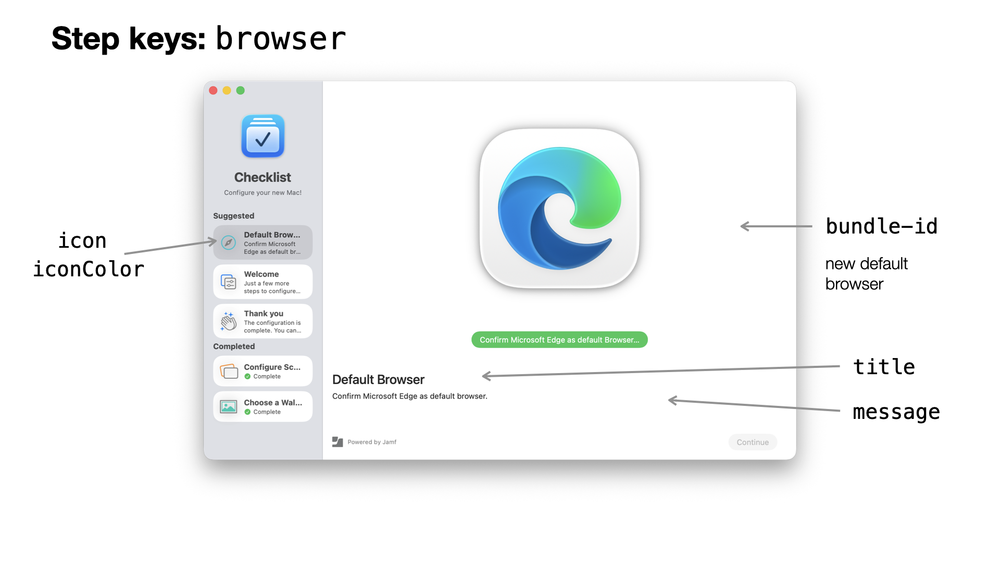

#  Configuration Profile - Setup Checklist

Note that the Welcome app which displays the full screen welcome and language is controlled by [a separate preference domain.](ConfigurationProfile-Welcome.md)

Preference domain: `com.jamf.setupchecklist`

You can find [an example plist file here](../Examples/com.jamf.setupchecklist.plist).

#### Debug Mode

key: `DEBUG`, boolean, optional, default: `false`

When set to true, the app will not actually perform any steps that will change a setting. Some other settings will also behave differently in DEBUG mode which will be called out in the documentation.

#### Icon

key: `icon`, string/[image source](ImageSources.md), [localizable](Localization.md), default: Setup Checklist app icon

The icon used at the top of the sidebar. The size of the icon is 90x90 pixels. (180x180 @ 2x)

```xml
<key>icon</key>
<string>name:Checklist</string>
```


#### Title

key: `title`, string, [localizable](Localization.md), default: 'Setup Checklist'

The title shown at the top of the sidebar, under the icon.

```xml
<key>title</key>
<string>Checklist</string>
```

#### Message

key: `message`, string/markdown, [localizable](Localization.md), default: 'Start here to set up your Mac.' (localized)

Short message shown under the icon and title in the sidebar.

```xml
<key>message</key>
<string>Configure your new Mac!</string>
```

#### Accent Color

key: `accentColor`, String/[color definition](DefiningColors.md), optional, default: system accent color

Sets the accent color for buttons, progress bar, SF Symbols, and other UI elements. Use this to match branding. See ['Defining Colors'](#defining-colors) for details.

Examples:

```
<key>accentColor</key>
<string>#FF0088</string>
```

```
<key>accentColor</key>
<string>##red</string>
```

#### Hide other Apps

key: `hideOtherApps`, Boolean, optional, default: `true`

Controls whether other apps are hidden at launch. Other apps are _not_ hidden when running in DEBUG mode.

Example:

```xml
<key>hideOtherApps</key>
<true/>
```

#### Show Icon in Dock

key: `showIconInDock`, Boolean, optional, default: `true`

Controls whether app icon is shown in the Dock. Icon will _always_ show in Dock when running in DEBUG mode.

```xml
<key>showIconInDock</key>
<false/>
```

## Steps

key: `steps`, array of dicts, required

The workflow in the Welcome app is divided into steps. Each step is shown as its own page and can perform actions.
Some steps will only display a message, an image, and/or a movie. Other steps will interact with the user and perform tasks depending on their selection.

### The Kind of Step

key: `kind`, String, required

Each step requires a `kind` key.

The available kinds are:

- `message`
- `wallpaper`
- `browser`
- `open`

#### Identifier

key: `identifier`, string, required, unique

Each step requires an identifier which needs to be *unique* among all steps. When there are two or more steps with the same identifier, only the first step will be used. You will see an error in the log.

The identifier is used for logging and tracking which steps have already been completed. You can use any text, as long as it unique. It is helpful to keep the identifier descriptive. I.e. use `browser-edge` for a step that sets the default browser to MS Edge or `message-greeting` for a step that shows a greeting message.

### Keys Common to all Steps


All steps share these keys:

#### Title

key: `title`, string, [localizable](Localization.md), optional, default depends on the step kind

The title of the shown in the sidebar list and the step view.

#### Message

key: `message`, string/markdown, [localizable](Localization.md), optional

A longer description of the step. This should contain some instructions of what needs to done.

#### Icon

key: `icon`, string/[image source](ImageSources.md), [localizable](Localization.md), optional, default depends on the step kind

The icon used for the step in the sidebar list. When no `image` or `movie` is set for a step, generally the `icon` is displayed in the step area, as well, though some kinds of steps have different behavior here.

The size of the icons in the list view is 36x36 pixels. (72x72 @2x) But since the same image may be used in place of the larger image, you may want to use higher resolution or scalable graphics (svg, pdf) here.

```xml
<key>icon</key>
<string>symbol:hand.thumbsup</string>
```

#### Image

key: `image`, String/[image source](#image-sources), [localizable](Localization.md), optional, default: `icon`

The image shown at the top of the step area. When the `image` has a value, that will be shown instead of a `movie`. When no `image` or `movie` key is set, `icon` will be used.

Some step kinds will have other defaults for the image, i.e. the `browser` step will use the target default browser's app icon. 

The size of the area available to the image will vary with window size and position, but 16:9 ratio landscape or square images work well.

```xml
<key>image</key>
<string>/System/Applications/Utilities/Screen Sharing.app</string>
```

#### Icon Color

key: `iconColor`, String/[color definition](DefiningColors.md), optional, default depends on the step kind

The highlight color used for SF Symbol icons and images. (Not all SF Symbols have a highlight color.)

Example:

```xml
<key>icon</key>
<string>symbol:hands.and.sparkles</string>
<key>iconColor</key>
<string>##teal</string>
```

#### Movie

key: `movie`, String, [localizable](Localization.md), optional

When set, the app will load this movie and display at the top of the step area. When the `image` key is set, that will be displayed instead of a movie.

The `movie` can be an absolute path to a local movie file or a `https` url.

The movie will loop (start over when it reaches the end) and is muted. Animated GIFs do _not_ work as movies.

The size of the area available to the image will vary with window size and position, but 16:9 ratio landscape or square movies work well.

```xml
<key>movie</key>
<string>/Library/Branding/Intro.mov</string>
```

### Window Position

key: `windowPosition`, string, default: `center`

When this key is set to `left` or `right` the window will be moved to left or right edge of the screen for this step and the sidebar will be hidden.

Example: 

```xml
<key>windowPosition</key>
<string>right</string>
```

## Step Kinds

Different kinds of steps may have more keys to configure their behavior.

### Message

kind: `message`

A Message step displays a title, a message and an icon. This is the most basic step and has no interaction.

Example: 

```xml
<dict>
  <key>icon</key>
  <string>symbol:hand.thumbsup</string>
  <key>identifier</key>
  <string>message-thankyou</string>
  <key>image</key>
  <string>/Library/Branding/BrandImage.png
  <key>kind</key>
  <string>message</string>
  <key>message</key>
  <string>The configuration is complete. Enjoy your Mac!</string>
  <key>title</key>
  <string>Thank you</string>
</dict>
```

### Wallpaper

kind: `wallpaper`

This step presents a grid of images in the given folder path and allows the user to set one as their wallpaper on all attached screens.


Example:

```xml
<dict>
  <key>identifier</key>
  <string>wallpaper</string>
  <key>kind</key>
  <string>wallpaper</string>
  <key>path</key>
  <string>/Library/Desktop Pictures</string>
</dict>
```

#### Path to Folder of images

key: `path`, string, optional, default: `/Library/Desktop Pictures`

All image files in this folder will be presented.


### Open

(kind: `open`)

Prompts the user to open an app, file or URL.

When the `title` is unset it will be 'Open <name>…' where '<name>' is the name of the app that will open the item. When `icon` is unset, it will be the icon of the app that will open the item.


Examples:

Open a website in the default browser:

Since the `icon` is not set this will show the app icon of the default browser.

```xml
<dict>
  <key>identifier</key>
  <string>open-scriptingosx</string>
  <key>item</key>
  <string>https://scriptingosx.com</string>
  <key>kind</key>
  <string>open</string>
  <key>title</key>
  <string>Open Scripting OS X</string>
</dict>
```

Open an application:

Since the `icon` is not set this will show the calculator app icon. Since the `title` is not set this will show 'Open Calculator…'

```xml
<dict>
  <key>identifier</key>
  <string>open-calculator</string>
  <key>item</key>
  <string>/System/Applications/Calculator.app</string>
  <key>kind</key>
  <string>open</string>
  <key>openAutomatically</key>
  <true/>
</dict>
```

#### Item

key: `item`, string, required

The item to open. The item can be an absolute path to a local file or app, e.g. `/Applications/Microsoft Company Portal.app`, or it can be a URL, e.g. `https://jamf.com` or `x-apple.systempreferences:com.apple.preference.security?Privacy_ScreenCapture`

#### Open Automatically

key: `openAutomatically`, boolean, default: false

When enabled, the item will be opened automatically when the step is displayed.

#### Hide

key: `hide`, boolean: default: false

Launches the app or URL, but hides the app (or keeps the app in the background). This is useful when you need to launch a process that should not be visible to the user.

### Default Browser

kind: `browser`

Prompts the user to set this browser as the default. The user cannot continue without approving the browser choice. When no `image` is given, the target browser's app icon will be used.



Example: 

```xml
<dict>
  <key>bundle-id</key>
  <string>com.microsoft.edgemac</string>
  <key>identifier</key>
  <string>browser-edge</string>
  <key>kind</key>
  <string>browser</string>
  <key>message</key>
  <string>Confirm Microsoft Edge as default browser</string>
</dict>
```

#### Bundle Identifier

(key: `bundle-id`, String, required)

The app [bundle identifier](../Extras/BundleIdentifiers.md) for the browser, e.g. `org.mozilla.firefox`. When the app cannot be found when Welcome app runs (i.e. the browser is not installed yet, this step will be skipped)

Common browser identifiers:

|Browser            |identifier           |
|-------------------|---------------------|
|Safari             |com.apple.safari     |
|Firefox            |org.mozilla.firefox  |
|Google Chrome      |com.google.Chrome    |
|Microsoft Edge     |com.microsoft.edgemac|


### Screen Recording/Sharing

kind: `screensharing`

This step will open the Screen Recording pane in Settings > Privacy & Security and monitor the state of the switches for the designated apps until all are enabled.

This step works well with a `windowPosition` setting of `left` or `right`


Example: 

```xml
<dict>
  <key>bundle-id</key>
  <array>
    <string>com.microsoft.teams2</string>
    <string>us.zoom.xos</string>
  </array>
  <key>icon</key>
  <string>symbol:rectangle.on.rectangle.angled</string>
  <key>identifier</key>
  <string>screensharing</string>
  <key>kind</key>
  <string>screensharing</string>
  <key>message</key>
  <string>Enable Screen &amp; System Audio Recording for Microsoft Teams</string>
  <key>openAutomatically</key>
  <true/>
  <key>title</key>
  <string>Configure Screen Sharing</string>
  <key>windowPosition</key>
  <string>right</string>
</dict>
```

#### Bundle Identifier

(key: `bundle-id`, String or array of strings, required)

The app [bundle identifier](../Extras/BundleIdentifiers.md) or identifiers for the application or tool which should be enabled for Screen Recording.

When no app with the bundle-identfier is found (usually the app is not installed yet) then it will be shown with a "not installed" label, but the user can proceed. When none of the apps are installed, this step will be skipped. The user can launch the app later, after the app(s) are installed and this step will show status correctly then.

You can give a single bundle identifier with a `string`:

```xml
<key>bundle-id</key>
<string>com.microsoft.teams2</string>
```

Or you can provide multiple identifiers with an array of strings:

```xml
<key>bundle-id</key>
<array>
  <string>com.microsoft.teams2</string>
  <string>us.zoom.xos</string>
</array>
```

Common identifiers for apps requiring Screen Recording access:

|Browser            |identifier           |
|-------------------|---------------------|
|zoom.us            |us.zoom.xos          |
|Microsoft Teams    |com.microsoft.teams2 |


#### Open Automatically

key: `openAutomatically`, boolean, default: false

When enabled, the Screen Recording pane in System Settings app will be opened automatically when the step is displayed.

```xml
<key>openAutomatically</key>
<true/>
```


