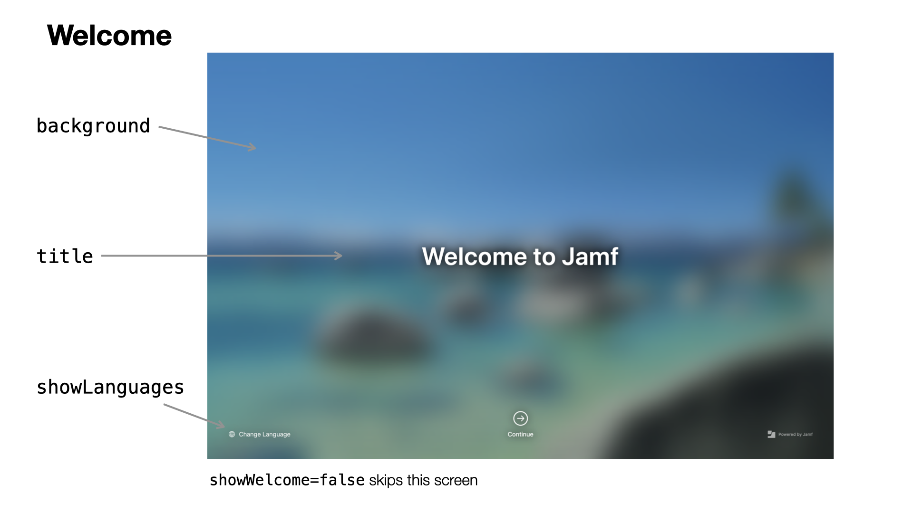

#  Configuration Profile - Welcome

Note that the Setup Checklist is controlled by [a separate preference domain.](SetupChecklist.md)

Preference domain: `com.jamf.setup.welcome`



You can find [an example plist file here](../Examples/com.jamf.setup.welcome.plist).

#### Debug Mode

key: `DEBUG`, boolean, optional, default: Setup Checklist `DEBUG` value or `false`

When set to true, the system language will not be changed.

When this key is unset in the Welcome app domain, it will use the value of the `DEBUG` key in the domain of the main Setup Checklist app, if present.

### Show Welcome screen

key: `showWelcome`, boolean, default: true

When set to `false` the welcome screen will be skipped and Setup Checklist will be opened directly.

Examples: 

Show Welcome screen:

```xml
<key>showWelcome</key>
<true/>
``` 

Skip Welcome screen (and language chooser)

```xml
<key>showWelcome</key>
<false/>
```

#### Title

key: `title`, string, optional, [localizable](../Extras/Localization.md), default: `Welcome`, localized to current language

Use this to customize the welcome message shown. When there is a single string value, it will be used for all languages. When the localization dict does not provide a localization for the current language, it will fall back to the `en` localization

Examples: 

Single language:

```xml
<key>title</key>
<string>Welcome to Jamf</string>
```

Localized:

```xml
<key>title</key>
<dict>
  <key>de</key>
  <string>Willkommen bei Jamf</string>
  <key>en</key>
  <string>Welcome to Jamf</string>
  <key>fr</key>
  <string>Bienvenue à Jamf</string>
  <key>nl</key>
  <string>Welkom bij Jamf</string>
</dict>
```

#### Background Image

key: `background`, string, optional, default: default system background image

Local path to an image that is used as the background for the welcome screen.

(**Note:** this does _not_ use the [image source](../Extras/ImageSources.md) syntax yet.)

Example:

```xml
<key>background</key>
<string>/Library/Desktop Pictures/Jamf.png</string>
```

#### Background Blur

key: `blur`, boolean, optional, default: true

Controls whether the background image is blurred (default) or not.

Example:

```xml
<key>blur</key>
<false/>
```

#### Title Color, Button Color

key: `titleColor`, string/[color definition](../Extras/DefiningColors.md), optional
key: `buttonColor`, string/[color definition](../Extras/DefiningColors.md), optional

By default, the Welcome app calculates the overall "lightness" of the background image and displays the title text and the buttons in a white font color for dark images and and black font color for light images.

For certain images that might not work so well, e.g. when the top two thirds are light and the lower third is predominantly dark, a black font will be chosen and the buttons will not have good contrast. Or you might want to choose a different color for branding.

Use this key to override the the default, calculated colors.

Example:

```xml
<key>buttonColor</key>
<string>##yellow</string>
<key>titleColor</key>
<string>##blue</string>
```

#### Title Font, Size, and Style

key: `titleFont`, string, optional, default: system font (Helevetica Neue)
key: `titleFontSize`, number, optional, default: 60
key: `titleFontStyle`, string, optional

These keys change the font, size and style of the 'Welcome' message on the full screen.

The style needs to match an available style of the font. Check the Font Book app to see which styles a font has available. You can combine two or more styles, e.g. `semibold italic condensed`, when available.

Example:

```xml
<key>titleFont</key>
<string>SF Pro Rounded</string>
<key>titleFontSize</key>
<integer>120</integer>
<key>titleFontStyle</key>
<string>semibold</string>
```

#### Show Languages

key: `showLanguages`, boolean, default: true

When set to `false` the language chooser will not be shown in the bottom leading corner.

Examples: 

Show "Change Language":

```xml
<key>showLanguages</key>
<true/>
``` 

Do not show "Change Language"

```xml
<key>showLanguages</key>
<false/>
```

#### Languages list

key: `languages`, array of language codes (string), optional, default: macOS system languages

By default, the language chooser shows all languages available in macOS. You can use this key to provide a shortened and/or re-ordered list of language codes, restricted to the languages you support.

Example:

```xml
	<key>languages</key>
	<array>
		<string>en-US</string>
		<string>en-GB</string>
		<string>de</string>
		<string>fr</string>
		<string>nl</string>
	</array>
```

#### Secondary Language Code

key: `secondaryLanguageCode`, language code (string), optional, default: `en-US`

When the users chooses a language, the choice will be set as the primary language and this value will be set as a secondary, fallback language.

Example:

```xml
<key>secondaryLanguageCode</key>
<string>de</string>
```
